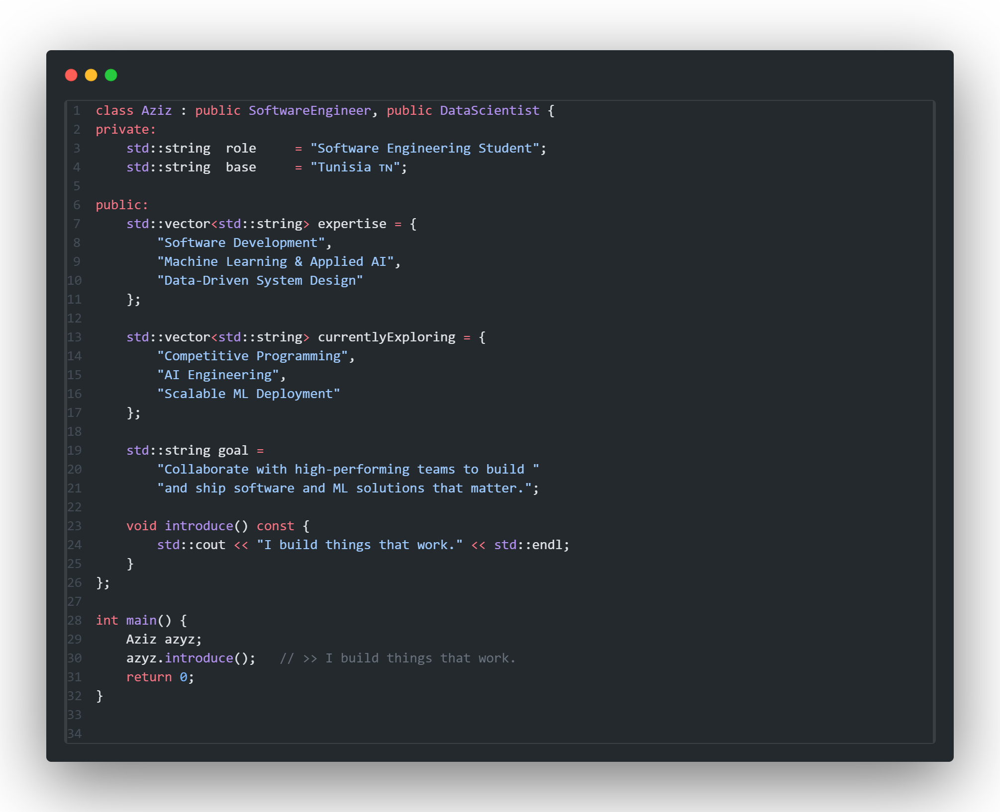

  

  

  
  

---

<h3 align="left">
  
  &nbsp;About Me
</h3>

---

  

---

<h3 align="left">
  
  &nbsp;Tech Stack
</h3>

---

<h4 align="center">Languages</h4>

  

<h4 align="center">Frameworks & Web</h4>

  

<h4 align="center">Databases</h4>

  

<h4 align="center">Tools & Cloud</h4>

  

<h4 align="center">Data & Analytics</h4>

  
  &nbsp;&nbsp;
  
  &nbsp;&nbsp;
  
  &nbsp;&nbsp;
  
  &nbsp;&nbsp;
  
  &nbsp;&nbsp;
  
  &nbsp;&nbsp;
  
  &nbsp;&nbsp;
  
  &nbsp;&nbsp;
  

---

<h3 align="left">
  
  &nbsp;GitHub Analytics
</h3>

---

  
  

  
  

